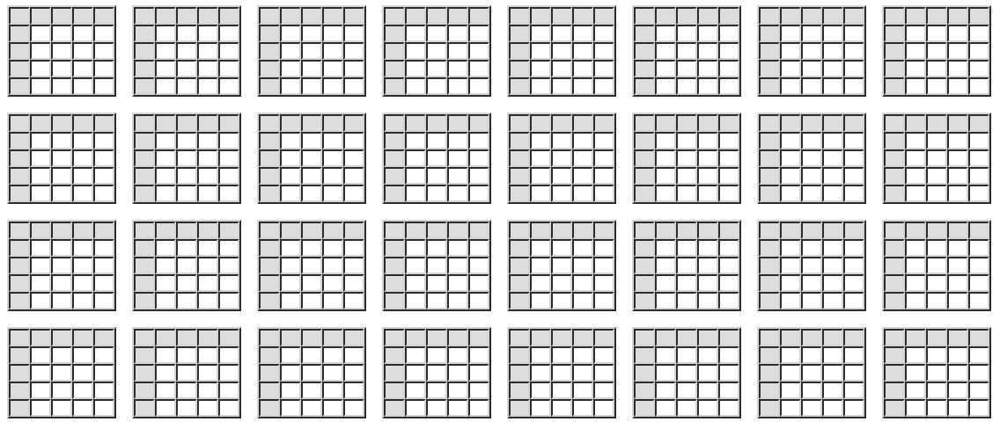
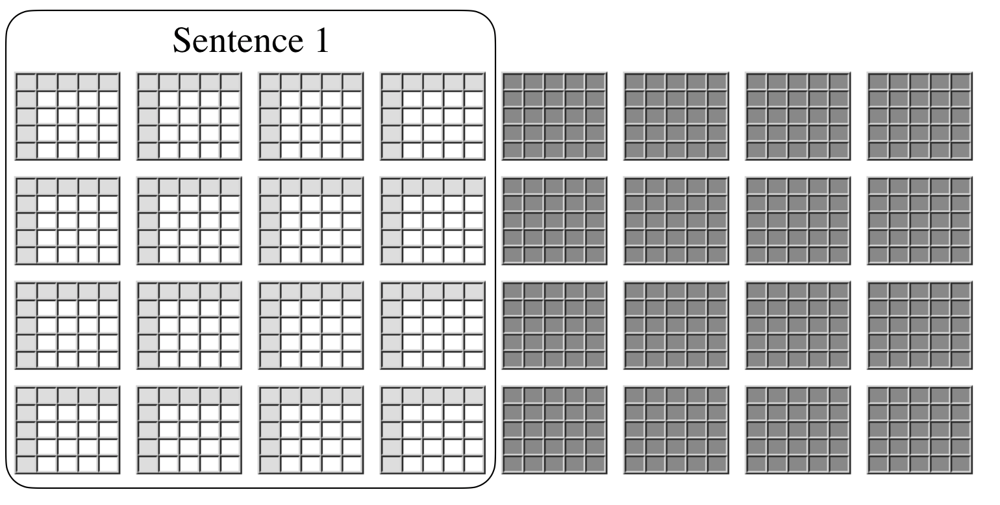
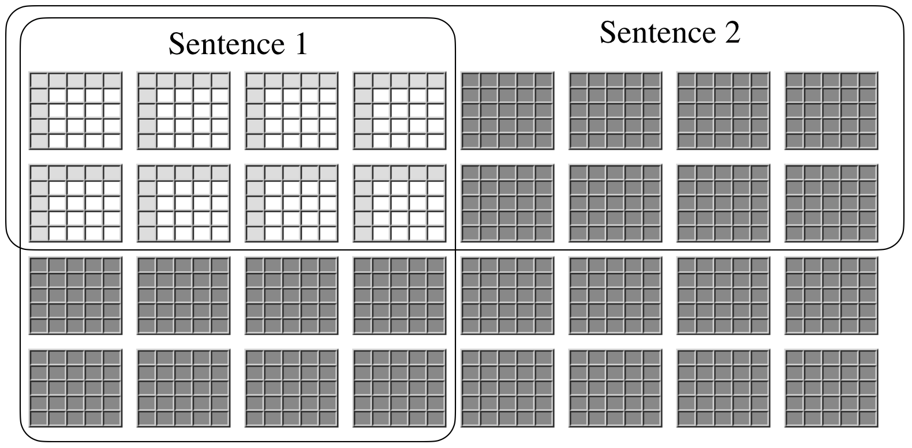
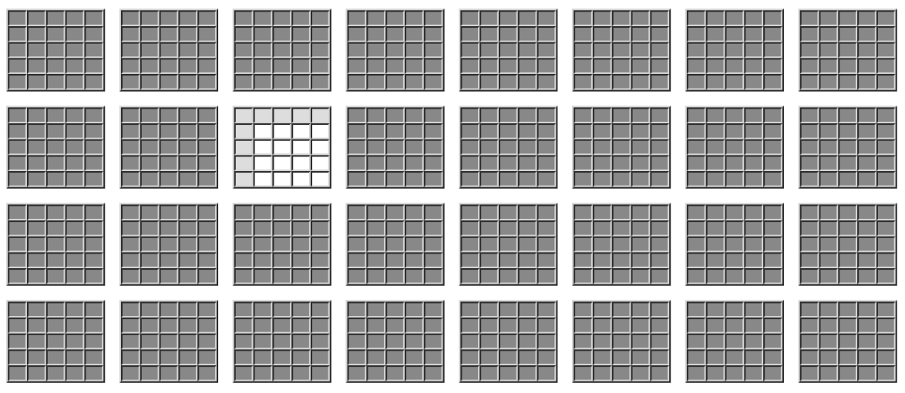

# 1.2 Логические высказывания
Для многих логика кажется эзотерической дисциплиной. Её якобы используют только математики при доказательстве сложных теорем в геометрии или теории чисел. Вся её суть — в написании формальных доказательств для публикации в научных статьях, которые мало связаны с повседневной жизнью.
Но это совсем не так.

В качестве примера использования логики в повседневной жизни можно рассмотреть взаимоотношения в небольшой группе друзей.
В группе всего четыре участницы: Аня, Белла, Вика и Галя.
Некоторые из них друг другу нравятся, а некоторые — нет.

На диаграмме слева показан один из возможных вариантов.
✔️ Галочка в первой строке означает, что Ане нравится Вика,
а отсутствие галочек — что Ане не нравится ни одна из других девушек (включая саму себя).
Белла тоже симпатизирует Вике.
Вике нравятся все, кроме самой себя.
Гале тоже нравится популярная Вика.

Разумеется, это не единственная возможная ситуация.
На правой диаграмме показан другой возможный «мир».
В нём каждой девушке нравятся ровно две другие, и каждая получает симпатию ровно от двух девушек.

<table>
  <thead>
    <tr>
      <th></th>
      <th>Аня</th>
      <th>Бэлла</th>
      <th>Вика</th>
      <th>Галя</th>
    </tr>
  </thead>
  <tbody>
    <tr>
      <td>Аня</td>
      <td></td>
      <td></td>
      <td>✔️</td>
      <td></td>
    </tr>
    <tr>
      <td>Бэлла</td>
      <td></td>
      <td></td>
      <td>✔️</td>
      <td></td>
    </tr>
    <tr>
      <td>Вика</td>
      <td>✔️</td>
      <td>✔️</td>
      <td></td>
      <td>✔️</td>
    </tr>
    <tr>
      <td>Галя</td>
      <td></td>
      <td></td>
      <td>✔️</td>
      <td></td>
  </tbody>
</table>

<table>
  <thead>
    <tr>
      <th></th>
      <th>Аня</th>
      <th>Бэлла</th>
      <th>Вика</th>
      <th>Галя</th>
    </tr>
  </thead>
  <tbody>
    <tr>
      <td>Аня</td>
      <td>✔️</td>
      <td></td>
      <td>✔️</td>
      <td></td>
    </tr>
    <tr>
      <td>Бэлла</td>
      <td></td>
      <td>✔️</td>
      <td></td>
      <td>✔️</td>
    </tr>
    <tr>
      <td>Вика</td>
      <td>✔️</td>
      <td></td>
      <td>✔️</td>
      <td>️</td>
    </tr>
    <tr>
      <td>Галя</td>
      <td></td>
      <td>✔️</td>
      <td></td>
      <td>✔️</td>
  </tbody>
</table>

Допустим, мы сами не знаем, кто из девушек кому симпатизирует, но у нас есть информаторы, которые готовы рассказать нам об этом.
Каждый информатор знает что-то одно о симпатиях и антипатиях девушек, но никто не знает всего.

И вот здесь в дело вступает логика. С помощью _логических высказываний_ каждый информатор может выразить точно то, что он знает — не больше и не меньше. Ниже приведены примеры различных типов логических высказываний:
- Первое высказывание — простое и прямое: оно сообщает нам, что Галя нравится Вике.
- Второе и третье высказывания — говорят о том, что не является истиной, но не уточняют, что является истиной.
- Четвёртое высказывание утверждает, что выполняется одно из условий, но не указывает, какое именно.
- Пятое высказывание сообщает общее правило, касающееся тех, кто нравится Ане.
- Шестое высказывание описывает общее правило относительно тех, кто нравится Вике.
- Последнее высказывание говорит что-то обо всех девушках сразу.

<i>
Гале нравится Вика. 
Ане <b>не</b> нравится Галя. 
Гале <b>не</b> нравится Аня. 
Бэлле нравится либо Вика, либо Галя. 
Ане нравятся все, кто нравится Бэлле. 
Вике нравятся все, кто нравится ей. 
Никто не нравится сам себе.
</i>

Если взглянуть на приведённые выше миры, мы увидим, что все эти утверждения являются истинными в мире слева. Напротив, несколько из них ложны в мире справа. Следовательно, мы можем исключить второй мир.

Разумеется, в общем случае существует больше двух возможных миров. На самом деле, возможных вариантов довольно много. Если взять четырёх девочек, существует шестнадцать возможных вариантов отношения "нравится" — Ане нравится Аня, Ане нравится Белла, Ане нравится Вика, Ане нравится Галя, Бэлле нравится Аня, и так далее. Каждое из этих шестнадцати утверждений может быть либо истинным, либо ложным. Существует 2¹⁶ (65 536) возможных комбинаций этих истинно-ложных вариантов, а значит, существует 65 536 возможных миров.

  

Логические высказывания, подобные приведённым выше, ограничивают возможные способы устройства мира. Каждое высказывание делит множество возможных миров на два подмножества: те, в которых высказывание истинно, и те, в которых оно ложно, как показано на следующем рисунке. Верить в высказывание — значит верить, что мир принадлежит первому подмножеству.

Если даны два высказывания, мы знаем, что мир должен находиться в пересечении множества миров, в которых первое высказывание истинно, и множества миров, в которых истинно второе высказывание.

В идеале, когда у нас достаточно высказываний, мы точно знаем, как обстоят дела.

Эффективное общение требует языка, который позволяет выразить то, что мы знаем — не больше и не меньше. Если нам известное состояние мира, мы должны сформулировать достаточно высказываний, чтобы передать эту информацию другим. Если же мы не знаем, каким именно может быть мир из нескольких возможных вариантов, нам нужен язык, который позволяет выразить лишь то, что нам известно — а именно, какие миры возможны, а какие нет. Язык логики предоставляет нам способ выразить неполную информацию, когда у нас есть только она, и полную информацию, когда она доступна.
