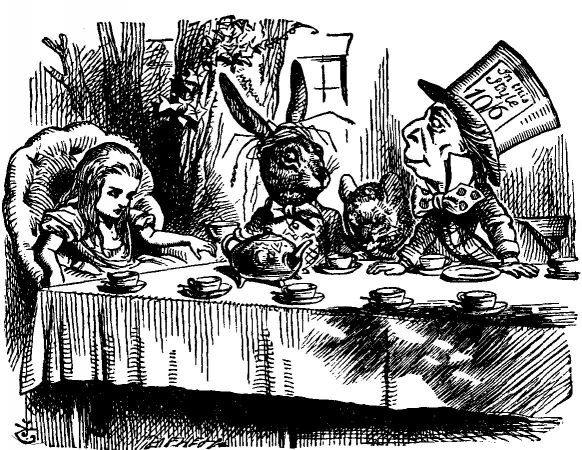

# Алиса в Стране чудес

Льюис Кэрролл включил в Алису в Стране чудес множество примеров кажущейся логической аргументации. Ниже приведён один из самых известных.

- Так бы и сказала, - заметил Мартовский Заяц. - Нужно всегда  говорить
то, что думаешь. 
- Я так и делаю, - поспешила объяснить Алиса. - По крайней  мере...  По
крайней мере я всегда думаю то, что говорю... а это одно и то же... 
- Совсем не одно и то же, - возразил  Болванщик.  -  Так  ты  еще  чего
доброго скажешь, будто "Я вижу то, что ем" и "Я ем то, что вижу", -  одно  и
то же! 
- Так ты еще скажешь, будто "Что имею,  то  люблю"  и  "Что  люблю,  то
имею", - одно и то же! - подхватил Мартовский Заяц. 
- Так ты еще скажешь, - проговорила, не открывая глаз, Соня, - будто "Я
дышу, пока сплю" и "Я сплю, пока дышу", - одно и то же!

(С) Перевод Н. М. Демуровой, иллюстрации Крис Ридделл

Алиса, по-видимому, считает, что утверждение p ⇒ q то же самое, что и q ⇒ p; но это логическая ошибка, на которую указывают Шляпник, Заяц и Соня. Явно, Алисе стоит записаться на курс «Введение в логику».